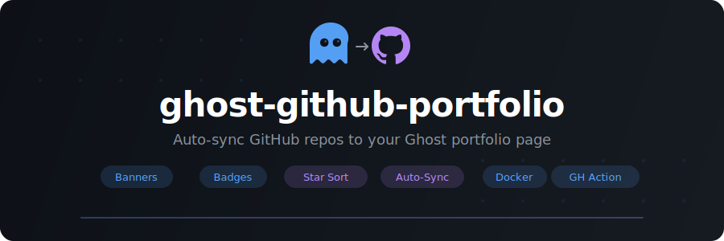

<p align="center">
  
</p>

<p align="center">
  <a href="https://www.npmjs.com/package/ghost-github-portfolio"></a>
  <a href="https://hub.docker.com/r/drumsergio/ghost-github-portfolio"></a>
  <a href="https://github.com/GeiserX/ghost-github-portfolio/actions/workflows/ci.yml"></a>
  <a href="LICENSE"></a>
  <a href="https://github.com/GeiserX/ghost-github-portfolio/stargazers"></a>
</p>

<p align="center"><strong>Auto-sync your GitHub repositories to a Ghost CMS portfolio page.</strong></p>

---

## What it does

`ghost-github-portfolio` fetches your public GitHub repositories, sorts them by stars, generates beautiful portfolio cards with banners and badges, and pushes the result to a Ghost page via the Admin API.

Run it daily via cron, GitHub Actions, or Docker to keep your portfolio always up to date.

**Features:**

- Fetches repos sorted by stars, filtered by configurable minimum
- Auto-detects banner images (`docs/images/banner.svg`, `media/banner.svg`, etc.)
- Dynamic shields.io badges (stars, forks, license, Docker pulls, website, awesome-list)
- Per-repo overrides (custom description, badges, Docker image, tech stack)
- Ghost lexical editor format (the current Ghost editor)
- Dry-run mode for previewing changes
- Runs as CLI, Docker container, or GitHub Action

## Quick start

### 1. Install

```bash
# npm (global)
npm install -g ghost-github-portfolio

# npx (no install)
npx ghost-github-portfolio

# Docker
docker pull drumsergio/ghost-github-portfolio:1.0.0
```

### 2. Create a config

```bash
ghost-github-portfolio init
```

This generates a `config.yml` with all available options. Edit it with your GitHub username and Ghost API credentials.

### 3. Get your Ghost Admin API key

1. Go to your Ghost Admin panel > **Settings** > **Integrations**
2. Create a new **Custom Integration**
3. Copy the **Admin API Key** (format: `KEY_ID:SECRET`)

### 4. Run

```bash
# Preview (no changes to Ghost)
ghost-github-portfolio sync --config config.yml --dry-run --verbose

# Sync to Ghost
ghost-github-portfolio sync --config config.yml --verbose
```

## Configuration

```yaml
github:
  username: YOUR_GITHUB_USERNAME
  # token: ghp_xxx  # Optional: higher rate limits (env: GHOST_GITHUB_TOKEN)

ghost:
  url: https://your-ghost-blog.com
  adminApiKey: "KEY_ID:SECRET_HEX"
  pageSlug: portfolio   # or pageId: "hex_id"

portfolio:
  minStars: 2
  maxRepos: 50
  includeForked: false
  badgeStyle: for-the-badge  # flat, flat-square, for-the-badge, plastic, social
  showBanner: true
  centerContent: true
  defaultBannerPath: docs/images/banner.svg

  bannerPaths:
    awesome-spain: media/banner.svg  # Override per repo

  excludeRepos:
    - .github

  repos:
    my-project:
      description: "Custom description"
      dockerImage: myuser/my-project  # Adds Docker pulls badge
      techStack: "Python, Docker, Redis"
      badges:
        - type: website
          url: https://my-project.com
        - type: awesome-list
        - type: platform
          label: macOS
          logo: apple
        - type: docs
          url: https://docs.my-project.com
        - type: custom
          label: MCP
          value: Official Registry
          color: E6522C

  footer:
    showStats: true
    showViewAll: true
```

### Environment variables

| Variable | Description |
|----------|-------------|
| `GHOST_GITHUB_TOKEN` | GitHub token for private repos / higher rate limits |
| `GHOST_ADMIN_API_KEY` | Ghost Admin API key (overrides config file) |

## Docker

```bash
docker run --rm \
  -v /path/to/config.yml:/config/config.yml \
  drumsergio/ghost-github-portfolio:1.0.0
```

### Docker Compose (daily cron)

```yaml
services:
  ghost-portfolio:
    image: drumsergio/ghost-github-portfolio:1.0.0
    volumes:
      - ./config.yml:/config/config.yml:ro
    # Run daily at 6 AM via external cron or restart policy
```

## GitHub Action

Create `.github/workflows/portfolio.yml` in any repo:

```yaml
name: Update Portfolio

on:
  schedule:
    - cron: "0 6 * * *"  # Daily at 6 AM UTC
  workflow_dispatch:       # Manual trigger

jobs:
  sync:
    runs-on: ubuntu-latest
    steps:
      - uses: actions/checkout@v4

      - uses: actions/setup-node@v4
        with:
          node-version: 22

      - run: npx ghost-github-portfolio sync --config config.yml --verbose
        env:
          GHOST_GITHUB_TOKEN: ${{ secrets.GHOST_GITHUB_TOKEN }}
```

Store `config.yml` in the repo (without secrets) and use environment variables for the API keys.

## How it works

1. **Fetches** all public repos for the configured GitHub user via the REST API
2. **Filters** by minimum stars, excludes forks and blocklisted repos
3. **Sorts** by star count (descending)
4. **Detects** banner images by checking common paths (`docs/images/banner.svg`, `media/banner.svg`, etc.)
5. **Generates** HTML cards with: banner, name, dynamic badges, description, tech stack
6. **Composes** a Ghost lexical JSON document (the format Ghost's editor uses internally)
7. **Updates** the target Ghost page via the Admin API with JWT authentication

Badges are dynamic (served by shields.io) — stars, forks, and Docker pulls update automatically on every page view without re-running the tool.

## Badge types

| Type | Auto-detected | Description |
|------|--------------|-------------|
| Stars | Yes | Always shown |
| Forks | Yes | Always shown |
| License | Yes | From GitHub repo metadata |
| Docker pulls | Config | Set `dockerImage` in repo overrides |
| Website | Yes | From GitHub homepage field |
| Awesome list | Yes | If repo has `awesome-list` topic |
| Docs | Yes | If homepage is a GitHub Pages URL |
| Platform | Config | Custom platform badge (macOS, Linux, etc.) |
| Custom | Config | Any shields.io-compatible badge |

## Roadmap

See [docs/ROADMAP.md](docs/ROADMAP.md) for the full roadmap, including themes, multi-CMS support, AI-powered features, analytics, team portfolios, and more.

## License

[GPL-3.0](LICENSE)
